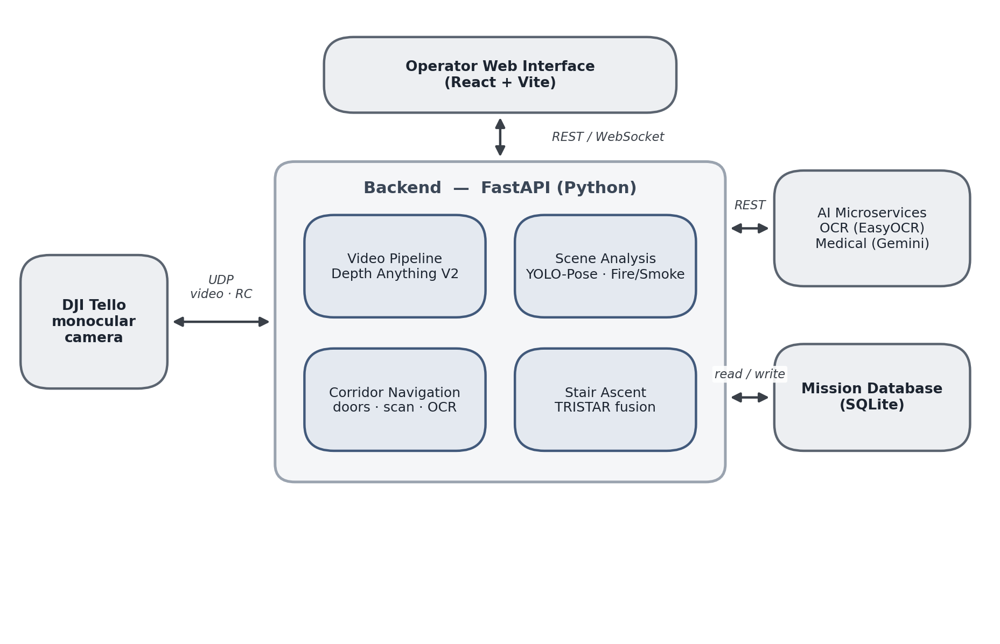
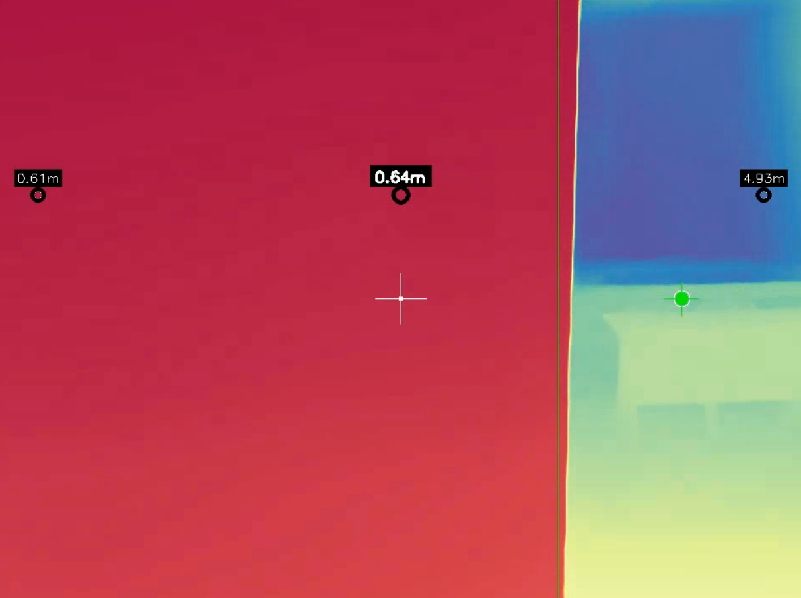
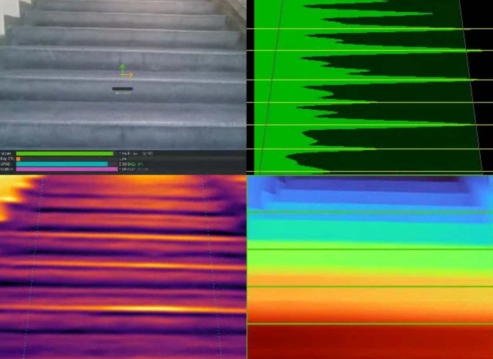

<div align="center">

# HawkOps — Autonomous Indoor Navigation & TRISTAR (Stair Climbing)

### Vision-only corridor exploration and stair climbing for low-cost search-and-rescue drones

**A commodity, sub-150 € DJI Tello turned into an autonomous indoor scout — using nothing but its single RGB camera.**

</div>

---

## What it does

Indoor search-and-rescue happens where there is no GPS, visibility is poor, and the building is unknown. Professional autonomous drones solve this with expensive LiDAR or stereo depth hardware. **HawkOps does it with a single monocular camera.**

Running entirely on top of a **DJI Tello** (≈80 g, list price under 150 €), the system turns the raw video stream into full autonomy through **calibrated monocular depth estimation** (Depth Anything V2) fused with classical computer vision. It drives two fully autonomous behaviours:

- **Corridor exploration** — finds open doors from their *geometric depth signature* (not their appearance), enters the room, reads the door number by OCR, scans for people, and reports.
- **Autonomous stair climbing** — **TRISTAR** (*TRI-Signal STair Ascent Recognition*), a fusion of three virtual sensors (Sobel + Gabor + depth) that decides when to climb and when the landing is reached.

Around these, lightweight models add victim/pose detection, fire & smoke detection, and AI hazard/medical triage — all fused into an automatic mission report.

## Demo

**Autonomous stair climbing (TRISTAR)**

https://github.com/user-attachments/assets/3d5d3528-6757-4b73-b5eb-1b701ca37751


**Autonomous corridor navigation & door entry**

https://github.com/user-attachments/assets/ecfd112e-a64a-44a2-bc59-aa99b21442ad


> If the players do not appear inline, the clips are in [`media/videos/`](media/videos/) — [tristar-nav.mp4](media/videos/tristar-nav.mp4) · [corridor_nav.mp4](media/videos/corridor_nav.mp4).

## Highlights

- **Monocular-only.** No LiDAR, no stereo, no depth camera, no external localisation — just one RGB feed.
- **Runs on a toy.** The whole autonomy stack sits on top of a sub-150 € DJI Tello.
- **Appearance-free door detection.** Doors are found as a *depth opening framed by vertical depth edges* — no labelled dataset, works even when the door frame leaves the field of view.
- **TRISTAR sensor fusion.** Three complementary virtual sensors make stair climbing robust where any single cue fails.
- **Calibrated depth.** An empirical room/corridor calibration cuts relative depth error from **27.4 % to below 10 %**.
- **Operational by design.** Live web dashboard, mission database, and an automatic post-mission report (rooms, occupants, hazards, OCR labels).

## How it works

<div align="center">

</div>

A local **FastAPI** backend runs all perception on-device and talks to a **React** operator interface, the drone (UDP), a mission database, and two optional AI microservices (OCR, medical/hazard). A single video pipeline produces a calibrated depth map that feeds every navigation decision.

| Appearance-free door detection | TRISTAR stair climbing |
|:---:|:---:|
|  |  |
| An open door is a *far region flanked by sharp vertical depth edges* (the casing) — recovered from the depth map, not from appearance. | Sobel (structure) + Gabor (texture) + depth (geometry) are fused into one confidence score that governs the ascent. |

## Results (real indoor flights)

| Metric | Result |
|---|---|
| Corridor missions (end-to-end) | **12 / 12** success |
| Door detection (offline) | **F1 = 0.91**, precision 0.93 |
| Calibrated depth error (room) | **~8.5 %** (from 27.4 % raw) |
| Stair climbing — full TRISTAR fusion | **4 / 4** flights |
| Stair climbing — any partial sensor set | ≤ 2 / 4 (each fails in a characteristic way) |

A dedicated **28-flight ablation** shows that *only* the full three-signal fusion succeeds on every flight — see [`tristar-ablation-study/`](tristar-ablation-study/), which contains the per-configuration plots and an English interpretation of every flight.

## Getting started

### Prerequisites
- **Python 3.11**, **Node.js 18+**
- A CUDA-capable GPU is recommended (CPU works, slower)
- A **DJI Tello** drone on the local network

### 1. Backend (FastAPI + vision pipeline)
```bash
cd backend
python -m venv .venv
# Windows: .venv\Scripts\activate   |   Linux/macOS: source .venv/bin/activate
pip install -r requirements.txt
python server.py
```

> **Perception models.** The depth model is third-party and not bundled. Clone
> [Depth Anything V2](https://github.com/DepthAnything/Depth-Anything-V2) into
> `backend/Depth-Anything-V2/` and place its checkpoint as described in that repo.
> Detection/OCR weights (YOLO, EasyOCR) download on first run.

### 2. Frontend (React + Vite operator interface)
```bash
cd frontend
npm install
npm run dev
```

### 3. AI microservices (optional — OCR & hazard/medical triage)
```bash
# Room-label OCR
cd ocr_service && pip install -r requirements.txt && python -m app

# Medical / hazard triage (needs a GEMINI_API_KEY)
cd ai_service && pip install -r requirements.txt && python -m app
```

Then open the web interface, connect the Tello, choose the start position (*hallway* or *stairwell*) and mission parameters, and launch.

## Repository structure

```
├── backend/                  # FastAPI server, depth pipeline, navigation, TRISTAR stair climber
├── frontend/                 # React + Vite operator dashboard
├── ai_service/               # Hazard / medical triage microservice (Gemini)
├── ocr_service/              # Room-label OCR microservice (EasyOCR)
├── tristar-ablation-study/   # Per-configuration ablation: flight plots + English interpretations
└── media/                    # Demo videos and images
```

## License

Released for academic and research use.

---

<div align="center">
<sub>Built to show how far low-cost, monocular-only autonomy can be pushed — one dark stairwell at a time.</sub>
</div>
